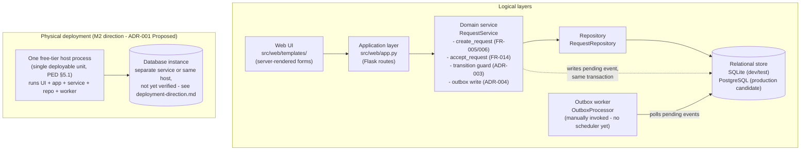

# ADR-001: Architecture Style and Technology Stack — Options and Traced Slice

- **Status:** Proposed
- **Date:** 2026-09-30
- **Deciders:** Masego (proposed); Emile (reviewed 2026-09-30, see §"Emile's review" below — agrees with the architecture style, per-layer options and the traced-slice choice; flags one gap); still needs Don

## Context

DEC-008 deferred the technology stack, architecture and deployment platform to M2, pending "a
small proof of concept covering login, saving data and deploying" on the actual Belgium Campus
platform. PED §16.2 (architecture baseline, M2) is left blank for the same reason and references
this ADR. PR #27 (ASR identification) already ties five requirement clusters to ADR-001 and
ADR-005, so the stack choice is not free-standing — it has to satisfy what ADR-002
(persistence), ADR-003 (lifecycle validator) and ADR-004 (notification fan-out) have already
accepted.

This ADR does two things the M2 brief asks for before construction starts: agrees the one
feature slice the team traces end to end, and lays out the stack options per layer against the
architecture those three accepted ADRs already commit us to. It does not close DEC-008 — that
still needs PoC evidence gathered on the real platform, which is Section 5 below.

## The traced slice: "Citizen submits a service request"

**Proposal: FR-005 / FR-006 — an authenticated Requester submits a request with a mandatory
category — is the slice we trace through every layer.**

Why this one rather than a harder slice:

- It is the natural entry point of the pipeline — nothing else in the system happens before a
  request exists — and it is the simplest complete vertical slice, so it is the cheapest way to
  prove the whole stack holds together (auth → form → validation → write → confirmation).
- It is the only slice that touches the **frontend**, which nothing built so far exercises. The
  M2 stack question explicitly needs a frontend option chosen; the acceptance-path PoC (below)
  never renders a screen.
- It directly produces the evidence DEC-008 asks for: authenticated submission requires **login**
  (DEC-006), the write **saves data**, and running it on the actual candidate host is the
  **deploy** leg. One slice, three pieces of required evidence.
- It does not duplicate work. Don's spike (`src/persistence/`, `tests/test_request_acceptance.py`)
  has already traced the harder half of the lifecycle — concurrent acceptance under
  ADR-002's versioned-aggregate pattern — and that test passes today. This slice is the
  complementary, simpler half; together they cover four of the five ASR drivers in PR #27
  (audit-trail immutability, the lifecycle machine indirectly, and now the frontend/auth surface
  neither has touched).

**One open question this slice forces us to answer, rather than assume:** FR-025 requires an
audit row on every *status change and assignment change*. Creation sets the initial status; it is
not a change from a prior one. Whether a request's creation gets its own audit row (for a
complete history from the very first moment) or whether the audit trail begins at the first
transition is a real design choice, not a detail — recommend: yes, write one, of `action_type =
'CREATED'`, so `RequestAudit` — already shaped for this in `docs/PED/17-data-persistence.md`
§17.2 — never has a gap between "this record exists" and "this record's first tracked event."
No outbox row is needed on creation itself: FR-009 triggers notification on accepted, rejected,
commented or completed, not on submission, so the requester's confirmation is the synchronous
response, not an async notification.

## Constraints

- **CN-01** — the slice must trace to SCOPE-I-02, not add scope.
- **CN-03** — free-tier hosting only; rules out anything that needs an always-on paid service.
- **CN-04** — every stack choice must still let NFR-001, NFR-002, NFR-007, NFR-013 be measured.
- **CN-05** — authenticated submission (DEC-006) means the stack must support session/token auth
  from this first slice, not bolt it on later.
- **CN-06** — the team is three part-time students of mixed, partly unknown proficiency; the
  decision needs an honest capability audit, not the familiar tool.
- **CN-07** — no guarantee any option is supported on the Belgium Campus desktop platform (brief
  §25). Nothing here is Accepted until verified there.
- **CN-08** — whatever is chosen goes through the same branch/PR/two-approval workflow already in
  force.

## Architecture diagram

Logical layers (left) inside the single physical deployment unit Option A commits to (right) —
the brief requires these kept visibly distinct rather than conflated:

**What this is not yet:** authentication/authorization has no box above — RSK-16 tracks that gap
explicitly; the diagram would grow an `Auth` layer between UI and Application once that ADR
exists. The outbox worker is drawn logically inside the same process because nothing has
justified splitting it out yet (PED §5.1's cost-chain reasoning), not because it was assumed.

## Alternatives considered — the architecture style

The three ADRs already accepted force this before any layer-by-layer choice:

| Option | Description | Pros | Cons |
|---|---|---|---|
| A | Single deployable unit — one backend process serving API and UI, one database | Matches the cost chain already worked through in PED §5.1: every extra separately-deployed service is another free-tier instance that sleeps | Less separation of concerns; scaling the whole unit together |
| B | Separate frontend and backend deployments (API + static SPA) | Cleaner separation, independently deployable | Two services idling out instead of one — directly contradicts the PED §5.1 conclusion and CN-03 |
| C | Microservices per bounded context | Textbook scalability | Wildly disproportionate to a 3-person team and CN-06; multiplies CN-08's two-approval overhead across services |

**Recommendation: Option A**, consistent with PED §5.1 and already implied by ADR-002 treating
the persistence layer as one transactional boundary.

## Alternatives considered — stack options per layer

Each option is evaluated against what ADR-002/003/004 already committed to: transactional
multi-table writes (request + audit \[+ outbox]), an optimistic-concurrency version column, a
transition-table validator in the service layer, and an outbox worker for async fan-out.

### Frontend

| Option | Description | Pros | Cons |
|---|---|---|---|
| A | Server-rendered templates in the same process as the backend | Ships inside the single deployable unit (Option A above) at zero extra hosting cost; no separate build/deploy step; simplest to get an authenticated form working for the slice | Less interactive; role-based views need server-side conditionals rather than client state |
| B | Separate SPA (React or Vue) calling a JSON API | Richer UX, clean API contract | A second build pipeline and, unless served as static files from the same origin, a second thing to keep warm — tension with CN-03 |
| C | Backend-rendered pages with light interactivity (e.g. HTMX-style partial updates) | Most of B's responsiveness without a separate build/deploy artifact | Smaller ecosystem than a full SPA; team has to learn the pattern (CN-06) |

**Recommendation: A for the M2 PoC**, because it proves the slice fastest and keeps the single
deployable unit intact; B or C can be revisited once a real UI-heavy screen (the staff queue)
makes the case for it.

### Backend

| Option | Description | Pros | Cons |
|---|---|---|---|
| A | Python (Flask or FastAPI) | Continues the existing spike directly — `RequestService` / `RequestRepository` already exist and `test_request_acceptance.py` already passes; zero rewrite of verified concurrency logic | Team's Python depth is not yet audited (CN-06) |
| B | Node.js (Express) | Also free-tier friendly; large ecosystem | Discards the Python PoC's verified optimistic-update test; re-proves what is already proven |
| C | Java (Spring Boot) or C# (ASP.NET) | May match prior coursework | Heavier footprint under free-tier always-on limits; slower iteration for a 3-person part-time team |

**Recommendation: A**, specifically because Option B/C would throw away working, tested evidence
for no engineering reason — the opposite of what DEC-008 is trying to avoid ("requirements bent
to fit a familiar tool" cuts both ways: don't discard a validated spike to chase one either).

### Database

| Option | Description | Pros | Cons |
|---|---|---|---|
| A | SQLite (file-based) | What the PoC already uses; zero hosting cost | Single-writer, single-file — a real SPOF once more than one process/instance touches it; free-tier hosts that redeploy or scale to zero can lose the file entirely, which fails NFR-011 (backup/restore) outright |
| B | PostgreSQL on a free tier (e.g. Supabase, Neon, Railway) | Full ACID multi-table transactions, supports the versioned-aggregate + audit + outbox pattern properly under concurrent connections, industry-standard, free tier exists | One more account/service to verify against CN-07 |
| C | MySQL/MariaDB on a free tier | Comparable viability to B | Historically weaker `CHECK` constraint support, which ADR-002's status enum currently relies on |

**Recommendation: keep A for local development and the automated test suite (no change needed —
it is already what `tests/test_request_acceptance.py` uses), but treat B as the production
candidate.** This is exactly the kind of claim CN-07 says cannot be taken on faith — it is
untested until the PoC actually deploys against it.

### Testing

| Option | Description | Pros | Cons |
|---|---|---|---|
| A | pytest | Near-zero-rewrite upgrade from the current `assert`-based script — same functions, real fixtures, proper pass/fail reporting a CI job can act on | One dependency to add |
| B | `unittest` (stdlib) | No dependency at all | More boilerplate; weaker fixture support for the DB setup/teardown every persistence test needs |
| C | Reach for a different framework entirely (implies backend option B/C) | — | Requires rewriting the one test that already passes |

**Recommendation: A.**

### CI

| Option | Description | Pros | Cons |
|---|---|---|---|
| A | GitHub Actions (continue) | Already governs branch protection and the two-approval rule (DEC-001); `docs-check.yml` and `secret-scan.yml` already run here; just add a `test.yml` that runs pytest | None material |
| B | A different hosted CI (GitLab CI, CircleCI, …) | — | Means bridging or moving off the platform DEC-001 already committed to, for no stated benefit |
| C | Self-hosted runner | Avoids any Actions minute limit | New operational SPOF for a 3-person team; conflicts with CN-06 |

**Recommendation: A** — add one workflow file, nothing else changes.

## Decision

Not yet — **Proposed**, pending Don and Emile's review and the PoC evidence in Section "What
this does not decide yet" below. If accepted as proposed: single deployable unit; Python
(Flask/FastAPI) backend continuing the existing spike; server-rendered frontend in the same
process; SQLite for dev/test, PostgreSQL free tier as the production candidate to verify; pytest;
GitHub Actions.

## Rationale

Every recommendation above is chosen to be *consistent with what ADR-002/003/004 already
accepted* rather than reopening them, and to *keep the Python spike's passing test as evidence
rather than discard it* — the same "don't retrofit requirements to a tool" logic DEC-008 states,
applied in reverse: don't discard a validated tool to chase familiarity either. The traced slice
is chosen because it is the one piece of the system nothing has touched yet (frontend, auth) and
because it is literally DEC-008's evidence bar in miniature.

## Trade-offs accepted

- Deferring the SPA/HTMX frontend question means the staff queue's real interactivity needs is
  not yet designed — accepted, because the submission slice does not need it and DEC-008 says
  choose in order, not all at once.
- Recommending Postgres as the production database while the spike still runs on SQLite means the
  PoC is not finished until it is actually verified against a hosted Postgres instance — this ADR
  stays Proposed, not Accepted, until that happens.

## Risks created

- RSK-03 (stack proves unavailable/unsupported on the Belgium Campus platform) and RSK-13
  (single-member knowledge concentration) are exactly what the PoC in Section 5 below is meant to
  retire before ADR-001 is marked Accepted.
- RSK-12 (late M1 baseline compresses M2) is why this ADR proposes rather than re-derives options
  from zero — it builds on ADR-002/003/004 instead of re-litigating them.

## Evidence

- `src/persistence/` and `tests/test_request_acceptance.py` — passing test for the
  optimistic-concurrency accept path (Python + sqlite3).
- ADR-002, ADR-003, ADR-004 — accepted patterns this ADR must stay consistent with.
- PED §5.1 — the cost-chain conclusion that a single deployable unit is forced by CN-03.
- `docs/requirements/functional-requirements.csv` — FR-005, FR-006, FR-009, FR-025.

## Downstream consequences

- Once accepted, the submission slice becomes the first thing built in `src/`, and its shape
  (auth check → validate → single transaction with the CREATED audit row) sets the pattern every
  other write follows.
- The Postgres-vs-SQLite question must be closed with an actual deployment attempt before M3,
  not assumed — this is the concrete PoC action item DEC-008 has been waiting on.

## What this does not decide yet

DEC-008 requires the PoC to run on the actual Belgium Campus platform before this ADR can move
from Proposed to Accepted. Concretely, still needed: confirm Python 3 and SQLite/Postgres
connectivity are available there; deploy the submission slice (login, save, and a real
deployment, not just `localhost`) to one free-tier host; measure whether it survives an idle
period without losing the SQLite file if SQLite is used anywhere beyond local tests. Until then
this stays Proposed and the team stays free to change any recommendation above on that evidence.

## Later consequence (updated when evidence emerges)

Left blank at decision time.

## Emile's review

Agree with the architecture style (single deployable unit), the per-layer recommendations, and
the FR-005/FR-006 traced-slice choice — each is argued from the ADRs and constraints already
accepted, not asserted, and I checked the reasoning holds against PED §5.1 and the ASRs in
`docs/PED/06-requirements.md` §6.3.

**One real gap: this ADR resolves five layers (frontend, backend, database, testing, CI) but
never places authentication or authorization architecturally**, even though two of the five ASR
drivers in §6.3 are exactly this — NFR-004 (authorisation enforcement) and NFR-012 (privacy of
requester information), both Must-priority and both requiring server-side enforcement "not
assumed." The traced slice currently ships against `REQUESTER_ID = 1`, a hardcoded stand-in with
no session, no role and no authorization check — correctly disclosed as a known limitation in
`src/web/app.py`, not hidden, but the architecture for what replaces it isn't decided anywhere
yet, and FEC-04 already warned this specifically: "retrofitting access control after features
exist means re-touching every endpoint individually."

**Proposed addition, consistent with the backend choice already made:** Flask-Login (or Flask's
built-in session mechanism) for authentication, with the role stored on the user record and
**authorization checks enforced in the service layer** — the same place ADR-002's transaction
boundary and ADR-003's transition validator already live — not in the Flask view functions. This
keeps the pattern this ADR already established (business rules in the service layer, views stay
thin) rather than introducing a second enforcement style for one specific concern. A view-level
check alone would satisfy NFR-004's letter today and fail it the moment a second entry point to
the same operation exists — exactly the FEC-04 risk above.

This doesn't block accepting the rest of ADR-001 — the architecture style, per-layer stack and
traced-slice choice all stand on their own reasoning. It does mean the next traced slice that
needs role differentiation (Staff accept/assign, FR-014) can't start until this gets its own
short ADR or an addition here. Logged as RSK-16 so it doesn't just live in this paragraph.
